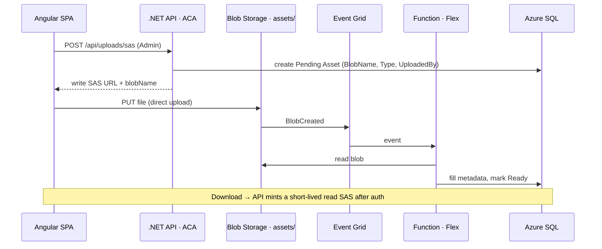

# ElectronicLibrary

> A private, self-hosted digital library — music scores first, extensible to diplomas, posters, and recordings.


A login-gated library for uploading, cataloguing, and serving files. **Music scores** (PDF + MusicXML) are the
first-class content type; the domain model is generalised so **diplomas, posters, and recordings (audio + video)**
slot in later without a redesign. Any signed-in user can browse and download; adding or removing content requires
the `Admin` role.

---

## Highlights

- **Direct-to-blob uploads via short-lived SAS** — files never stream through the API. The client requests a write
  SAS, then `PUT`s the file straight to Blob Storage.
- **One processing pipeline behind `IAssetProcessor`.** Whether a file arrives from the app or is dropped straight
  into storage, a single background function handles it.
- **Dual blob trigger.** Event Grid in production (near-instant, scale-to-zero) and a classic polling trigger for
  local dev — the same processing runs against Azurite with no cloud resources, and the polling trigger is disabled
  in production via app setting.
- **Secure downloads.** The container stays private; the API mints a short-lived **read** SAS per file, only after
  authorization.
- **ASP.NET Core Identity.** Self-service registration (custom endpoint that also captures first/last name), a
  single `Admin` role for write/delete, opaque tokens via `MapIdentityApi`.
- **CQRS with MediatR**, FluentValidation as a pipeline behavior, soft-delete + audit trail on every entity.
- **Angular 22 SPA** with Angular Material, bilingual UI (English + Polish) via `ngx-translate`.
- **Observability & docs** built in: OpenTelemetry → Azure Monitor, Swagger/OpenAPI.

---

## Architecture



Files live in a **single `assets` container** partitioned by virtual-folder prefixes (`scores/`, `diplomas/`,
`posters/`, `recordings/`). Uploader identity and idempotency are handled by pre-creating a `Pending` asset row at
SAS-mint time (keyed by a unique `BlobName`); the function fills the file-derived fields and flips it to `Ready`.

**Hosting & delivery**

| Concern             | Target                                                         |
| ------------------- | -------------------------------------------------------------- |
| API                 | Azure Container Apps (scale-to-zero)                           |
| Background function | Azure Functions **Flex Consumption** (Event Grid blob trigger) |
| Frontend            | Azure Static Web Apps                                          |
| Data / files        | Azure SQL · Azure Blob Storage                                 |
| Orchestration & IaC | **.NET Aspire** AppHost + **azd**                              |
| CI/CD               | GitHub Actions (via `azd pipeline config`)                     |

The Aspire AppHost is the single source of truth: the same resource graph runs emulators locally (Azurite + SQL
Server) and provisions the real Azure resources — including managed-identity role assignments — at deploy time.

---

## API

| Method   | Route                             | Auth  | Purpose                                    |
| -------- | --------------------------------- | ----- | ------------------------------------------ |
| `POST`   | `/api/auth/register`              | anon  | Register (email, password, first/last name)|
| `POST`   | `/login`, `/refresh`              | anon  | Sign in / refresh (`MapIdentityApi`)       |
| `GET`    | `/api/users/me`                   | user  | Current user + roles                       |
| `GET`    | `/api/assets`                     | user  | List assets                                |
| `GET`    | `/api/assets/{id}`                | user  | Asset details                              |
| `GET`    | `/api/assets/{id}/download-sas`   | user  | Short-lived read SAS                        |
| `POST`   | `/api/uploads/sas`                | Admin | Short-lived write SAS (+ `Pending` asset)  |
| `DELETE` | `/api/assets/{id}`                | Admin | Soft-delete                                |

---

## Tech stack

**Backend** — .NET 10 · ASP.NET Core · EF Core 10 · ASP.NET Core Identity · Azure Functions (isolated worker) ·
MediatR 14 · AutoMapper 16 · FluentValidation 12 · Swashbuckle (Swagger) · OpenTelemetry + Azure Monitor

**Frontend** — Angular 22 · Angular Material · ngx-translate (EN/PL) · ngx-toastr · RxJS

**Platform** — .NET Aspire · azd · Azure (Container Apps, Functions, Blob Storage, SQL, Event Grid, Static Web Apps)

---

## Project structure

```
src/
  ElectronicLibrary.Domain          Common (BaseEntity, ISoftDeletable), Entities (Asset), Enums, Models
  ElectronicLibrary.Application      CQRS/Assets (feature folders), Behaviors (validation), Interfaces, Profiles
  ElectronicLibrary.Infrastructure   Services, models, middleware, extensions
  ElectronicLibrary.Persistence      DbContext, EntityConfigurations, Identity, Migrations, Repositories, Seeder
  ElectronicLibrary.Api              Controllers (BaseController + Execute helpers), request models
  ElectronicLibrary.Functions        Triggers: Event Grid (prod) + polling (local) -> IAssetProcessor
aspire/
  ElectronicLibrary.AppHost          Aspire orchestration (Azurite + SQL + api + functions)
  ElectronicLibrary.ServiceDefaults
client/                              Angular 22 SPA (Material, i18n EN/PL)
tests/
  ElectronicLibrary.Tests
```

---

## Getting started

### Prerequisites

- .NET 10 SDK
- Node.js (LTS) + npm
- Docker (Aspire runs **Azurite** and **SQL Server** in containers)
- [Azure Developer CLI (`azd`)](https://learn.microsoft.com/azure/developer/azure-developer-cli/) — for deployment

### Run locally

```bash
# API + Function + Azurite + SQL, orchestrated by Aspire
dotnet run --project aspire/ElectronicLibrary.AppHost

# Frontend (ng serve)
cd client && npm install && npm start
```

The Aspire dashboard surfaces every service and its logs. Locally, the polling blob trigger picks up files dropped
into Azurite automatically, so the upload → process loop works end-to-end without any cloud resources.

---

## Configuration

- Connection strings (`sqldb`, `blobs`) and service wiring are injected by **Aspire** locally and by **azd** in
  Azure — nothing to hand-configure for a standard run. The blob container name (`assets`) and CORS origins live
  under `Storage` / `Cors` in `appsettings.json`.
- **MediatR / AutoMapper license keys** (free Community edition): set `Licensing:MediatRCommunityKey` and
  `Licensing:AutoMapperCommunityKey` in app settings, or the `MEDIATR_LICENSE_KEY` / `AUTOMAPPER_LICENSE_KEY`
  environment variables in the cloud. Keys are self-service and free for this project from
  [mediatr.io](https://mediatr.io) and [automapper.io](https://automapper.io). The app runs without them (a startup
  log warning is the only effect).

---

## Deployment

```bash
azd up                 # provision + deploy the whole stack
azd pipeline config    # wire up GitHub Actions for deploy-on-push
```

`azd up` provisions Blob Storage, Azure SQL, the Container App (API), the Flex Consumption function, the Event Grid
subscription, and the managed-identity role assignments from the Aspire graph. In production the local polling
trigger is turned off via the `AzureWebJobs.AssetBlobTrigger_Polling.Disabled` app setting, leaving Event Grid as
the sole source. The Angular SPA deploys to Static Web Apps via its own GitHub Action.

---

## Roadmap

- [ ] Thumbnail / preview generation (the `ThumbnailBlobName` field and preview dialog exist; the pipeline is TBD)
- [ ] Per-type metadata extraction (MusicXML: composer, instrument, key; PDF page counts)
- [ ] Recordings pipeline (audio + video); heavier video transcode via Durable Functions or a Container Apps job
- [ ] Search & filtering (composer, instrument, tags)
